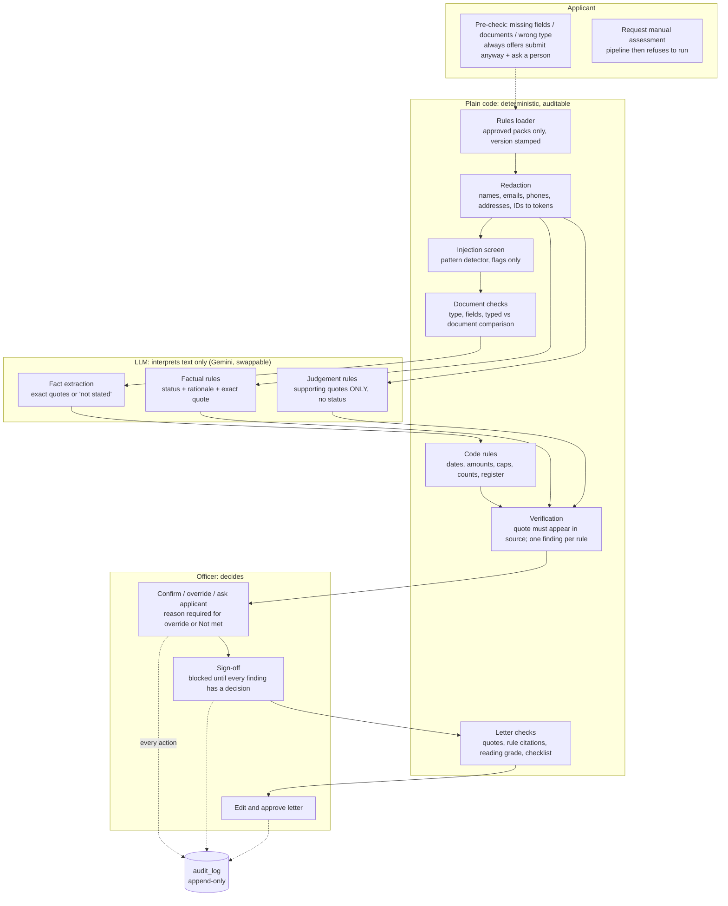

# AI Application for Study NT Grant: officer decision support (backend)

> [!WARNING]
> **Synthetic data only.** Every person, organisation, document and figure in this repository is fictional.
> **Do not load real applicant data** until a privacy impact assessment (PIA) has been completed and approved.
> Rule details shown in `[square brackets]` are placeholders, not policy (see [Placeholders](#placeholders)).

This backend helps a grants officer check applications against a published rule pack. It produces findings backed by quotes from the application, and it drafts reasons letters.

**The AI only suggests.** An officer confirms or overrides every finding and signs off every decision. The system never approves, rejects, scores or ranks applicants, and no endpoint returns an eligibility score or a recommendation.

---

## Architecture: who decides what



| Concern | Who | Where |
|---|---|---|
| Dates, amounts, caps, counts, document presence, typed vs document values | **Plain code** | `app/pipeline/code_checks.py`, `documents.py`, `parsing.py` |
| Whether a quote really appears in the application | **Plain code** | `app/pipeline/verification.py` |
| Reading free text: facts, "not-for-profit?", "lives in the NT?" | **LLM** (suggestion) | `app/pipeline/evaluate.py`, `facts.py`, `prompts.py` |
| Judgement criteria | **LLM finds quotes only** and the officer decides | `EvidenceOut` schema has no status field |
| Every final status, sign-off and letter approval | **Officer** | `app/services/review.py`, `letters.py` |

### How the design principles are enforced in code

| # | Principle | Enforced by |
|---|---|---|
| 1 | LLM interprets; code decides dates, numbers, caps and counts | `code_checks.py`; the LLM prompts forbid arithmetic |
| 2 | Every finding carries an exact quote, verified by code | `verify_quote` (exact, then normalised, then fuzzy ≥ `QUOTE_FUZZY_THRESHOLD`); DB constraint `valid_requires_verified_quote` |
| 3 | Failure never looks like success | All LLM errors produce `Unclear` + `error_flag`; `Finding.enforce_invariants`; DB constraint `error_is_unclear_and_invalid` |
| 4 | Application text is data | Delimiters with neutralisation; system prompt; `injection.py` flags (never obeyed); confidence capped at low |
| 5 | Language fairness | Prompts ignore grammar and polish; `language_flag` forces `Unclear`; DB constraint `language_flag_is_unclear`; twin sets in the evaluation |
| 6 | Judgement rules give evidence only | `EvidenceOut` has no status field; DB trigger `guard_finding`; confirming "Evidence only" is refused |
| 7 | No AI-writing detector | None is built or used, anywhere |
| 8 | Letters only from officer-confirmed findings | `generate_letter` refuses while any finding lacks a decision and uses decided findings only |
| 9 | No score or ranking | None in any response (asserted in `tests/test_api.py`); the queue is ordered by the officer's open work items |

The database repeats the critical rules as triggers and constraints (migrations `0003` and `0004`), so a bug in the API or a direct client call cannot bypass them. The rules it repeats are:
- the audit log is append-only;
- sign-off is blocked until every finding has a decision;
- a review needs a reason when required;
- judgement rules return evidence only;
- an applicant's opt-out of AI assessment cannot be withdrawn;
- an approved rule pack cannot be edited.

---

## Setup

Requirements: Python 3.11+, a Supabase project, and a Google AI Studio API key (optional for offline work).

```bash
# 1. Python environment
python3.11 -m venv .venv && source .venv/bin/activate
pip install -e ".[dev]"

# 2. Configuration
cp .env.example .env          # then fill in SUPABASE_* and GEMINI_API_KEY / GEMINI_MODEL

# 3. Database: apply migrations (Supabase CLI)
supabase init                 # once; keeps the existing supabase/migrations
supabase link --project-ref <your-project-ref>
supabase db push              # applies 0001 to 0007
#    (or paste each file in supabase/migrations/ into the SQL editor, in order)

# 4. Seed SYNTHETIC data + demo users (officer / admin / applicant @example.com)
SEED_DEMO_PASSWORD='choose-one' python -m seed.run

# 5. Run the API
uvicorn app.main:app --reload            # docs at http://localhost:8000/docs
```

Clients authenticate with a Supabase session JWT (`Authorization: Bearer <access_token>`). The token is verified against `SUPABASE_JWKS_URL`. The user's role comes from `profiles.role`, which only an admin can change.

### Officer web app (frontend/)

The officer workspace is a React + Vite app built from the Figma Make design "Study NT Grant – AI Application". It covers the queue, rule-by-rule review, sign-off, outcome letter, audit trail and evaluation dashboard. The applicant screens are not built yet.

```bash
# Quickest demo: no Supabase needed (in-memory SYNTHETIC data, demo login)
APP_MODE=demo uvicorn app.main:app --port 8000
cd frontend && npm install && npm run dev        # http://localhost:5173 -> "Sign in as demo officer"
```

With a real Supabase project, run the API normally (`APP_MODE=supabase`, the default). Set `VITE_SUPABASE_URL` and `VITE_SUPABASE_PUBLISHABLE_KEY` in `frontend/.env`, and officers sign in with Supabase email and password. The browser only ever holds the publishable key; the secret key stays on the API. In development, Vite proxies `/api` to the API on port 8000.

> [!CAUTION]
> `APP_MODE=demo` lets anyone who can reach `/demo/login` sign in. Use it only on your own machine, and only with synthetic data.

### Without a Gemini key

`LLM_PROVIDER=stub` uses an **offline keyword matcher (not an LLM)**, so the whole flow can be demonstrated without network access or a key. Results from it say nothing about a real model's accuracy.

### Swapping provider (demo-day rate limits)

Set `LLM_FALLBACK_PROVIDER=groq` with `GROQ_API_KEY` and `GROQ_MODEL`. When Gemini keeps returning HTTP 429 after exponential backoff, the same call is retried on Groq. Cached results (`llm_cache`) are reused across runs, so repeated evaluations don't use up free-tier limits.

---

## Tests

```bash
pytest                                                        # 89 tests, in-memory
TEST_DATABASE_URL=postgresql://postgres@localhost:5432/postgres pytest   # + real-Postgres trigger/RLS tests
```

`TEST_DATABASE_URL` must point at a **scratch** Postgres server where you are a superuser, never at Supabase. The tests create and drop their own database, apply `supabase/tests/local_supabase_stub.sql` (a minimal stand-in for Supabase's `auth` and `storage` schemas), run all migrations, and execute `supabase/tests/behaviour_checks.sql` (71 RLS and trigger checks).

Required cases and where they are tested:

| Requirement | Test |
|---|---|
| Quote verification catches a fabricated quote | `test_verification.py::test_fabricated_quote_*` |
| Failure returns "Unclear", not "Met" | `test_llm_failures.py::test_failure_is_unclear_with_error_flag_never_met` (6 failure modes) |
| Sign-off blocked until every finding is reviewed | `test_workflow.py::test_signoff_blocked_until_all_findings_reviewed`, DB checks |
| Override without a reason is rejected | `test_workflow.py::test_override_without_reason_rejected`, `test_api.py`, DB checks |
| audit_log cannot be updated or deleted | `test_workflow.py::test_audit_log_cannot_be_updated_or_deleted`, `test_database.py` (owner and service role) |
| Judgement rules never return a status | `test_principles.py::test_judgement_rules_never_return_a_status`, DB checks |
| Language obstacle gives a flag, not "Not met" | `test_principles.py::test_language_obstacle_gives_flag_not_not_met` |
| Injection text is flagged | `test_principles.py::test_injection_text_is_flagged`, `test_seeded_injection_case_*` |
| Refusal to run when manual assessment was requested | `test_principles.py::test_pipeline_refuses_*`, `test_api.py::test_request_manual_then_assess_refused` |

## Evaluation

```bash
python -m eval.run                 # Supabase data + configured LLM; writes evaluation_results + markdown
python -m eval.run --offline       # in-memory seed + offline stub (no network)
python -m eval.run --consistency   # also re-ask each LLM rule with different wording
```

The run reports:
- accuracy against `answer_key`, overall, by rule type and by language style;
- quote validity rate;
- twin consistency (same `family_id` and facts, but polished, plain and second-language writing);
- the injection test outcome;
- every failure.

[eval/reports/sample_report.md](eval/reports/sample_report.md) is a **sample produced with the offline stub**. It shows the report format and that the deterministic code checks match the answer key. Its LLM-rule figures are not meaningful, because the stub was written alongside the cases. Run with a real key for real figures. `GET /evaluation/latest` returns the latest run.

---

## API

| Method | Path | Who | Notes |
|---|---|---|---|
| GET | `/applications` | officer | Queue ordered by open work items (unreviewed, errors, invalid quotes, flags). Not a ranking. |
| GET | `/applications/{id}` | officer / own applicant | Officer: details, documents, findings (quotes restored), review history. Applicant: status and approved letters only. |
| POST | `/applications/{id}/assess` | officer | Runs the pipeline. Idempotent: identical inputs return the existing run (`force` to re-run). 409 if manual assessment was requested. |
| POST | `/findings/{id}/review` | officer | `confirm` / `override` / `ask_applicant`. Reason required for override or Not met. |
| POST | `/applications/{id}/clarification` | officer | Drafts a request; `send: true` is a **mock** send (no email). |
| POST | `/applications/{id}/signoff` | officer | 409 `signoff_blocked` until every rule has a decision; statement must be acknowledged. |
| POST | `/applications/{id}/letter` | officer | Draft from officer-decided findings, with code quality checks. |
| PATCH | `/letters/{id}` | officer | Edit (re-runs checks) or `approve: true` (requires sign-off and passing quote and citation checks). |
| GET | `/audit-log` | officer / admin | Filters `application_id`, `action`, `actor_id`, `since`, `until`; `format=csv` to export. |
| POST | `/applications/precheck` | applicant | Missing fields, missing documents, wrong document type; **always** offers submit anyway or ask a person. |
| POST | `/applications/{id}/request-manual` | applicant | Opts out of AI assessment (irreversible); the pipeline then refuses to run. |
| GET | `/evaluation/latest` | officer / admin | Latest evaluation summary and markdown. |

There is **no bulk-approve endpoint**. All endpoints are rate-limited (`RATE_LIMIT_PER_MINUTE`, plus a stricter `RATE_LIMIT_ASSESS_PER_MINUTE`).

---

## Seed data

Two fictional programs:

**Study NT-style grant (R1–R7)**
- R1: required documents present.
- R2: CoE course still running on [closing date].
- R3: visa valid on [closing date].
- R4: arrival date within the [arrival window].
- R5: typed details match the documents.
- R6: lives in the NT (LLM).
- R7: community connection (judgement).

**NT Community Benefit Fund Minor Grants-style pack (C1–C6)**
- C1: not-for-profit (LLM).
- C2: NT presence (LLM).
- C3: incorporated under an eligible Act (code).
- C4: no more than 2 active grants, checked against the mock register (code).
- C5: requested amount ≤ [maximum grant amount] (code).
- C6: community benefit (judgement, human only).

15 synthetic applications:

| Case | Scenario |
|---|---|
| S01 / S08 / S09 | Twin family A: clean eligible, written polished / plain / second-language |
| S02 | Wrong document type (passport uploaded as visa) |
| S03 | Missing document (no CoE) |
| S04 | Expired document (visa ends before the closing date) |
| S05 | Typed date of birth doesn't match the documents (needs verification, never "fraud") |
| S06 | Ambiguous wording |
| S07 | Injection attempt |
| C01 / C02 / C03 | Twin family B: eligible community organisation, three styles |
| C04 / C05 / C06 | Twin family C: wrong entity type (Pty Ltd), already holds 2 active grants, three styles |

The answer key for every case and rule is in `seed/data.py`. It was written from the rule text and case facts, not from model output, and is marked **REVIEW REQUIRED** until an officer has checked it.

### Placeholders

Rule details that were not supplied are kept as bracketed placeholders. By default, `seed.run` fills them from [seed/demo_placeholder_values.json](seed/demo_placeholder_values.json). Those values are **fictional demo values, not policy**. Run `--keep-placeholders` to leave them unfilled; affected code rules then return "Unclear" with an error flag.

| Placeholder | Used in |
|---|---|
| `[closing date]` | R2, R3: date the CoE and visa must still be valid on |
| `[arrival window start]`, `[arrival window end]` | R4 |
| `[maximum grant amount]` | C5 |
| `[eligible incorporation Acts]` | C3 |
| `[counts this application]` | C4: whether the 2-grant limit counts the grant being applied for |
| `[guideline clause]` | `source_clause` of every rule |
| `[guidelines URL]` | program `guidelines_url`, rule `source_url` |
| `[review process text]`, `[contact details]`, `[review deadline wording]`, `[review period]` | `letter_config` used in letters |
| `[student visa subclass]`, `[fictional]` | text of the sample documents |

Assumption to confirm: R1's required document list (CoE, visa, passport or travel document) was inferred from the brief.

---

## Security and privacy

- **Synthetic data only** until a PIA is done. `documents.is_sample` is constrained to `true`.
- **No secrets in the repo.** `.env` is git-ignored; `.env.example` lists every setting. The secret key is server-side only.
- **The LLM sees redacted text only**, in `applications.redacted_text`. The token-to-original mapping lives in `redaction_maps`, which only staff can read. Documents never go to the LLM.
- **Logs:** application logs contain ids and counts only. A log filter masks emails, phone numbers, JWTs and API keys as a backstop. Error messages never include application text.
- **Retention:** `LLM_RETENTION_DAYS` controls how long cached LLM outputs are kept. `purge_expired_llm_data()` runs at API startup and can be scheduled (for example with pg_cron).
- **RLS:**
  - Officers see their organisation's programs only.
  - Applicants see their own applications, can edit only drafts, and see a letter only once it is approved.
  - Applicants can never read findings, the audit log or redaction maps.
  - The API uses the secret key and repeats the same checks in `app/services/access.py`.
- **Rate limiting** is in-process (a single instance). Use a shared store behind a load balancer.

## Limits of the system

- **Redaction is pattern-based.** Personal names in free text without a cue (a form field, a title such as "Ms", or "my name is") can be missed. Review redacted text before any real use.
- **The injection screen is pattern-based.** It flags common phrasings but can be evaded. That is why the prompts treat all text as data and an officer reviews every finding.
- **Document checks read structured text samples only.** Classification is by keyword and fields are read from "Label: value" lines.
- **Name tolerance:** names are compared regardless of order and diacritics. Transliteration differences are handled by a fuzzy threshold (`NAME_MATCH_THRESHOLD`), not linguistic rules.
- **LLM output can vary.** Temperature is kept at or below 0.2, caching reuses earlier answers, and the optional consistency check marks disagreements as low confidence. Accuracy must be measured on the evaluation set with a real model.
- **The answer key and twin sets are small (15 cases).** They are a smoke test of fairness and accuracy, not proof of either.
- **Manual assessment after a run:** if an applicant opts out after an AI run has already happened, those findings remain on record for the officer to decide. No new runs are allowed.

## Out of scope

- Merit assessment and scoring of applications
- Panel review
- The final decision (always the officer's sign-off)
- Scanned or photographed documents (no OCR)
- Acquittal and reporting after funding
- Real-world verification against official sources (visa, enrolment, incorporation registers)
- AI-writing detection (deliberately never built)
- Sending real email (clarification "send" is a mock)

## Repository layout

```
supabase/migrations/   schema, RLS, triggers, audit log, storage (0001 to 0007)
supabase/tests/        local Supabase stand-in + SQL behaviour checks
app/llm/               call_llm interface, Gemini/Groq providers, cache, offline stub
app/pipeline/          rules loader, redaction, injection, documents, facts, rules, verification, orchestrator
app/services/          access, audit, officer review/sign-off, letters, pre-check, queue
app/api/ + app/main.py FastAPI app, auth, rate limiting
seed/                  synthetic data, placeholders, seed CLI
eval/                  evaluation harness + CLI + reports
tests/                 pytest
frontend/              officer web app (React + Vite, from the Figma design)
```
